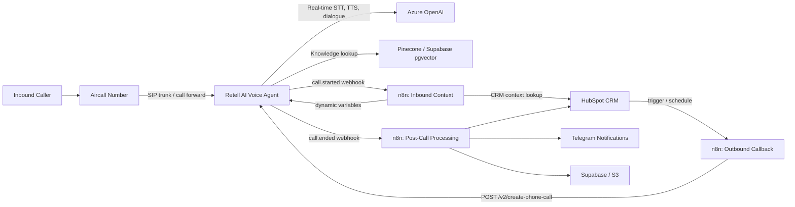

# Architecture

## Confirmed Stack

| Layer | Tool | Reason |
|-------|------|--------|
| **Telephony** | Aircall | Business number, HubSpot native integration, SIP forwarding to Retell AI |
| **Voice AI** | Retell AI | Low latency, outbound call API, dynamic variables, n8n webhook native, lowest cost |
| **Orchestration** | n8n Cloud | Webhook handling, CRM updates, retries, notifications, outbound triggers |
| **Post-Call AI** | Azure OpenAI (GPT-4o-mini) | Structured extraction, intent, sentiment, summarization |
| **CRM** | HubSpot | Source of truth — contacts, notes, tasks, deals |
| **Knowledge Base** | Pinecone or Supabase pgvector | RAG for grounded answers during conversation |
| **Notifications** | Telegram | Real-time alerts — leads, errors, escalations |
| **Storage** | Supabase or AWS S3 | Raw transcripts, call analysis JSON, dead-letter queue |

## High-Level System

## Design Principle

n8n is the orchestration brain, not the live audio engine. Retell AI handles real-time STT, dialogue, TTS, interruption handling, and latency. n8n handles context lookup, CRM updates, post-call analysis, notifications, retries, and outbound callback orchestration.

## Why Retell AI Over Alternatives

| Platform | Decision | Reason |
|----------|----------|---------|
| Retell AI | ✅ **Selected** | Native outbound API, dynamic variables, Aircall SIP support, lowest cost, n8n webhook ready |
| Vapi | Reserve option | Good if mid-call function calling needed in future |
| ElevenLabs Conversational AI | No | No outbound call API |
| Twilio | No | No AI agent layer — requires full custom build |
| Amazon Connect | No | Enterprise overhead, overkill |
| Genesys Cloud | No | Enterprise pricing, not HubSpot-native |
| Salesforce Einstein Bots | No | Salesforce CRM only |
| Cognigy / Kore.ai / LivePerson | No | Enterprise cost, long implementation |
| Amazon Lex | No | NLU only, no voice agent, requires Connect |
| Nuance | No | Healthcare/telco enterprise, not relevant |

## Component Responsibilities

### Aircall

- Owns the public business phone number.
- Forwards inbound calls to Retell AI via SIP trunk or number forwarding.
- Provides business telephony continuity and fallback to human agents.
- HubSpot native integration for call logging.

### Retell AI

- Hosts inbound and outbound voice agents.
- Performs real-time STT, dialogue management, TTS, interruption handling.
- Sends `call.started` webhook → n8n inbound context (before conversation).
- Sends `call.ended` webhook → n8n post-call processing (transcript + metadata).
- Receives dynamic variables from n8n (`first_name`, `caller_type`, `lifecycle_stage`).
- Outbound calls triggered via `POST /v2/create-phone-call` from n8n.

### n8n Cloud

- Receives webhooks.
- Looks up and updates HubSpot records.
- Calls Azure OpenAI for structured analysis.
- Sends Telegram notifications.
- Stores raw and normalized call data.
- Triggers outbound AI callbacks.
- Handles retries and dead-letter paths.

### HubSpot

- Source of truth for leads, customers, companies, deals, tickets, notes, and tasks.
- Stores concise AI-generated call notes.
- Stores follow-up tasks assigned to owners.

### Azure OpenAI

- Performs structured post-call extraction.
- Classifies intent and sentiment.
- Generates concise summaries.
- Converts transcript into reliable CRM-ready JSON.

### Knowledge Base

Use Pinecone, Supabase pgvector, Azure AI Search, or AWS Bedrock Knowledge Bases.

Recommended starting point:

- Pinecone if you want dedicated vector infrastructure.
- Supabase pgvector if you want vector search and relational storage together.
- AWS Bedrock Knowledge Bases if you want a managed AWS-native RAG layer.

## Data Flow: Inbound Call

1. Caller dials Aircall number.
2. Aircall routes or forwards to Retell/Vapi.
3. Retell/Vapi triggers n8n inbound context webhook.
4. n8n searches HubSpot by caller phone.
5. n8n returns context variables to the voice agent.
6. Voice agent conducts conversation.
7. Call ends.
8. Voice platform sends transcript and metadata to n8n.
9. n8n calls Azure OpenAI for structured analysis.
10. n8n updates HubSpot note/task/contact/deal/ticket.
11. n8n sends Telegram alert.
12. n8n stores raw transcript and analysis.

## Data Flow: Outbound Callback

1. HubSpot, schedule, or manual trigger starts callback workflow.
2. n8n fetches contact and last interaction context.
3. n8n checks consent, DNC, business hours, and attempt limits.
4. n8n calls Retell/Vapi outbound call API.
5. Voice agent speaks with lead/customer.
6. Post-call workflow processes transcript and updates HubSpot.

## Idempotency

Every workflow must use a stable idempotency key.

Recommended keys:

- inbound context: `provider_call_id`
- post-call processing: `provider_call_id + event_type`
- outbound callback: `hubspot_contact_id + callback_campaign_id + attempt_number`

Store processed keys in Supabase, Airtable, n8n Data Store, or another lightweight database.

## Error Handling

Each workflow should have:

- validation node for required payload fields;
- retry-enabled HTTP requests;
- error branch;
- dead-letter storage;
- Telegram notification for failures;
- manual replay instructions.

## Security Boundaries

- n8n credentials store all tokens.
- HubSpot private app scopes are minimized.
- Webhook endpoints use random paths plus signature verification where available.
- Raw transcripts are stored outside HubSpot when sensitive.
- HubSpot receives summaries and operational notes, not unnecessary sensitive details.
- Recording URLs should be access-controlled or short-lived.

## Scalability

The architecture scales by separating real-time voice from asynchronous processing.

- Voice concurrency is controlled in Retell/Vapi/Aircall.
- n8n executions process webhooks asynchronously.
- Large transcripts are stored externally.
- CRM updates are compact and idempotent.
- Notifications are event-driven.

